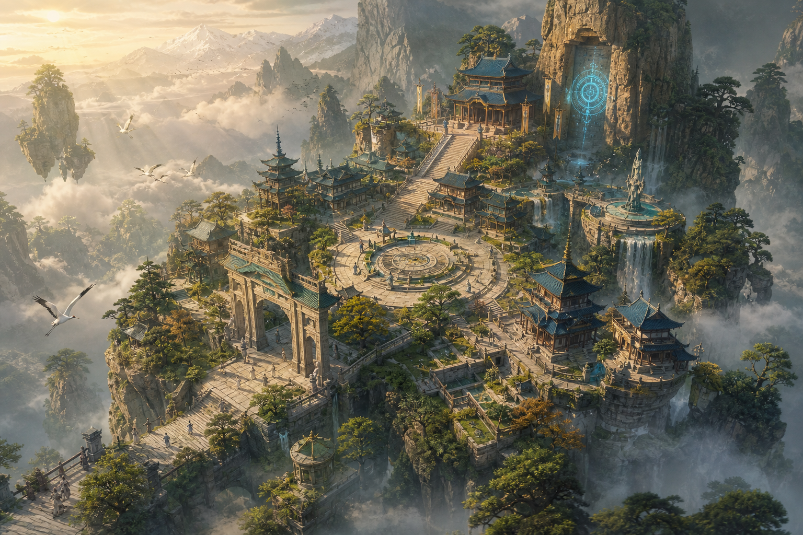

# 🏔️ CULTIVATION — A 3D Isometric Xianxia Action RPG

> *You are a mortal child, one of thousands who dream of immortality.*
> Enter a sect, forge your Dao, survive its politics, ascend through 16 realms — and leave behind a bloodline.

Semi-realistic painterly Xianxia inspired by **No Mortal Space**, **Oriental Immortal**, and **Immortal Life**.



## ▶️ Play Now (Part 1: Mortal Roots — playable)

```bash
cd game
python3 -m http.server 8080
# open http://localhost:8080
```

No build step. Any static server works. `game/` is also ready for **GitHub Pages** (root: `/game`).

### What's playable in Part 1
- **Character creation** — 6 mortal origins, 7 sects, dramatic spirit-root awakening, physiques
- **3D isometric sect grounds** — pagoda, mountain gate, arena, herb mountain, caves, day/night cycle
- **Direct action controls** — WASD, dodge-dash, 3-hit combos, charged heavy, block, lock-on, 45° camera rotation + zoom
- **Real cultivation loop** — meditate → progress → bottleneck breakthroughs → Qi Sensing → Qi Condensation 1–9
- **Sect life** — Elder Yun's guidance, Rival Chen Hao spar duel, mission board, herb gathering, spirit stones
- **Full HUD** — HP/Qi/Stamina, realm, lifespan, hotbar, journal, cultivation screen, autosave

## 🎨 Concept Art (locked before modeling)

| Sheet | Content |
|---|---|
| [Protagonist](docs/concepts/01-protagonist-multiview.png) | Mortal → Outer → Inner disciple turnarounds |
| [Enemies](docs/concepts/02-enemies-multiview.png) | Bandit, demonic cultivator, corpse puppet, spider beast |
| [Spirit Beasts](docs/concepts/03-spirit-beasts-pets-multiview.png) | Crane, fox cub, tiger cub, dragon whelp |
| [Architecture](docs/concepts/04-sect-architecture-multiview.png) | Gate, pagoda, alchemy pavilion, arena, cave |
| [Powers & FX](docs/concepts/05-cultivation-powers-fx.png) | Qi auras, sword qi, fireball evolution, tribulation |
| [World](docs/concepts/06-world-isometric-concept.png) | Sect valley isometric panorama |
| [Sect Interiors](docs/concepts/07-sect-interiors.png) | Throne hall, library, alchemy chamber, cave, barracks |
| [World Panoramas](docs/concepts/08-world-panoramas.png) | Mortal capital, beast forest, demonic ruins, immortal palace |
| [Protagonist II](docs/concepts/09-protagonist-expansion.png) | Training, breakthrough, tribulation, elder robes, weapon variants |
| [Enemies II](docs/concepts/10-enemies-expansion.png) | Bandit chief, rogue, demon wolf, serpent, golem, skeleton general |
| [Sect Hierarchy](docs/concepts/11-sect-hierarchy-npcs.png) | Sect Leader → Servant Disciple, full 9-rank lineup |
| [Realms & VFX II](docs/concepts/12-realms-vfx-expansion.png) | Aura ladder, Dao manifestation, soul avatar, domains, bloodline |
| [Interiors II](docs/concepts/13-sect-interiors-2.png) | Mission hall, vault, punishment hall, bathhouse, spirit mine |
| [Panoramas II](docs/concepts/14-world-panoramas-2.png) | Frozen north, flamelands, sea isles, thunder plateau |
| [Heroine](docs/concepts/15-heroine-multiview.png) | Female hero turnarounds, mortal → inner disciple |
| [Life Stages](docs/concepts/16-protagonist-lifestages.png) | Hero at 8 / 16 / 25 / 200 / 2000 years |
| [Enemies III](docs/concepts/17-enemies-3.png) | Ape, ghostface, toad, panther, corpse general, mosquitoes |
| [Peak Masters](docs/concepts/18-peak-masters.png) | The Seven Peak Masters lineup |
| [Sect Staff](docs/concepts/19-sect-staff.png) | Deacons, keeper, guard, pill boy, enforcer, chef |
| [Beasts II](docs/concepts/20-spirit-beasts-2.png) | Qilin, frost wolf, thunder eagle, turtle, carp, rabbit |
| [Weapons](docs/concepts/21-weapons-artifacts.png) | Full armory + storage ring + flying boat |
| [Alchemy](docs/concepts/22-pills-herbs-materials.png) | Pill ladder, herbs, ores, talismans, furnace |
| [Buildings II](docs/concepts/23-sect-exteriors-2.png) | Mission hall, treasure pavilion, punishment cliff, plaza, dome |
| [Secret Realms](docs/concepts/24-secret-realms.png) | Sunken palace, sky isles, volcanic heart, mirror maze |
| [Companions](docs/concepts/25-dao-companions.png) | Sword fairy, alchemist, tamer, witch, holy maiden |
| [Family](docs/concepts/26-children-family.png) | Child stages, training, family robes |
| [Bosses](docs/concepts/27-arc-bosses.png) | Demonic heir, serpent king, fallen elder, heart demon lord |
| [Tribulations](docs/concepts/28-tribulations-phenomena.png) | Lightning, karma fire, heaven's eye, soul chains, blood moon |
| [Formations](docs/concepts/29-formations-talismans.png) | Five grand arrays + five-talisman set |
| [Mounts](docs/concepts/30-mounts-flying-treasures.png) | Crane, sword, boat, gourd, tiger, kite glider |
| [Kingdoms](docs/concepts/31-mortal-kingdoms.png) | Emperor, general, merchant, auctioneer, smith, innkeeper |
| [Demonic Sect](docs/concepts/32-demonic-sect.png) | Demon lord, blood elder, asura, succubus, puppeteer, traitor |
| [Commerce](docs/concepts/33-auction-commerce.png) | Auction hall, black market, appraisal, stalls, vault |
| [Bonding](docs/concepts/34-bonding-ceremony.png) | Vow ritual, robes, dual chamber, soul resonance, token |
| [Sect War](docs/concepts/35-sect-war.png) | Battlefield, sky duel, siege, banners, medic tent |
| [Celestial Court](docs/concepts/36-celestial-court.png) | Emperor, consort, general, scribe, warden |
| [Divine Beasts](docs/concepts/37-divine-beasts.png) | Dragon, phoenix, tiger, tortoise, qilin |
| [Artifacts](docs/concepts/38-legendary-artifacts.png) | 8 famous treasures with lore |
| [Life Skills](docs/concepts/39-life-skills.png) | Fishing, cooking, farming, mining, runes, grooming |
| [Festivals](docs/concepts/40-festival-events.png) | Lanterns, tournament, feast, new year, fireworks |
| [Seven Sects](docs/concepts/41-seven-sects-disciples.png) | Signature disciple of each sect |
| [Heaven Map](docs/concepts/42-higher-realm-architecture.png) | Heaven gate, observatory, palace, steles, bridge |
| [Sunken Palace](docs/concepts/43-sunken-palace-interior.png) | Coral throne, library, vault, garden, whirlpool gate |
| [Wedding Feast](docs/concepts/44-wedding-feast.png) | Feast hall, tea rite, fireworks, gifts, sword dance |
| [Demon Lands](docs/concepts/45-demonic-lands-map.png) | Blood marsh, bone desert, citadel, fallen battlefield |
| [Heaven Armory](docs/concepts/46-heavenly-armory.png) | 6 endgame gear sets |
| [Pet Evolutions](docs/concepts/47-pet-evolutions.png) | Fox / carp / tiger / crane lines |
| [Uniforms](docs/concepts/48-rank-uniforms.png) | Servant → Elder progression |
| [Night Market](docs/concepts/49-night-market.png) | Food, fortunes, performers, trinkets, tea house |
| [Ancestors & Dao](docs/concepts/50-ancestral-dao.png) | Ancestral hall, steles, mural, platform, bell |
| [Final Arena](docs/concepts/51-final-arena.png) | Throne of Heaven, 3 phases |
| [Ascension](docs/concepts/52-ascension-ceremony.png) | Platform, gate, farewell, first step, registry |
| [Council Drama](docs/concepts/53-council-drama.png) | Table, accusation, vote, expulsion, ballot room |
| [Rogue Camps](docs/concepts/54-rogue-camps.png) | Cliff camp, bounties, fence, fight pit, oath fire |
| [Spirit Veins](docs/concepts/55-spirit-vein-caverns.png) | Vein hall, nooks, guardians, shaft, vein heart |
| [Mishaps](docs/concepts/56-alchemy-mishaps.png) | Explosion, poison, golem, frost, lucky success |
| [Tomb Raid](docs/concepts/57-tomb-raid.png) | Sealed door, traps, chamber, guardian, niche |
| [Skyships](docs/concepts/58-skyship-combat.png) | Battleship, skiff, broadside, boarding, crash |
| [Gate Defense](docs/concepts/59-gate-defense.png) | Gate hold, batteries, charge, last stand, repairs |
| [Rebirth](docs/concepts/60-reincarnation-lobby.png) | Ferry, judgment, memory well, gates, altar |
| [Dao Garden](docs/concepts/61-dao-fruit-garden.png) | Garden view, ancient tree, mirror pool, petal path, fruit shrine, meditation terrace |
| [Endings](docs/concepts/62-ending-variants.png) | Submit, defy, sect eternal, bloodline |
| [Training Grounds](docs/concepts/63-training-grounds.png) | Courtyard, dummy views, sword lanes, waterfall, obstacle course, arena plan |
| [Tournament Grounds](docs/concepts/64-tournament-grounds.png) | Stadium, duel platform, waiting room, judges balcony, trophy, arena plan |
| [Spirit Forge](docs/concepts/65-spirit-forge.png) | Workshop, furnace views, anvil, quenching pool, assembly bench, floor plan |
| [Healing Pavilion](docs/concepts/66-healing-pavilion.png) | Ward, bedside, herb bench, recovery pool, healer turnaround, garden plan |
| [Beast Sanctuary](docs/concepts/67-beast-sanctuary.png) | Habitat, stable, aviary, fox den, incubator, feeding court |
| [Spirit Farming](docs/concepts/68-spirit-farming.png) | Terraces, greenhouse, water wheel, growth stages, harvest station, field plan |
| [Mountain Expedition](docs/concepts/69-mountain-expedition.png) | Cliff route, rope bridge, shelter, ice cave, expedition gear, route plan |
| [Desert Caravan](docs/concepts/70-desert-caravan.png) | Oasis camp, skiff turnaround, pack beast, tent, waystation, caravan plan |
| [Sect Construction](docs/concepts/71-sect-construction.png) | Exploded hall, wall kit, bridge elevations, scaffolding, storage yard, settlement plan |
| [Sect Seasons](docs/concepts/72-sect-seasons.png) | Courtyard in four seasons; gate at dawn and night |
| [Spirit Library](docs/concepts/73-spirit-library.png) | Archive hall, shelf elevation, reading room, sealed vault, memory orb, floor plan |
| [Mountain Prison](docs/concepts/74-prison-complex.png) | Cliff gate, sealed cell, restraint ring, guard corridor, quiet court, floor plan |
| [Messenger Network](docs/concepts/75-messenger-network.png) | Post station, dispatch room, courier turnaround, capsule, landing platform, floor plan |
| [Fishing Retreat](docs/concepts/76-fishing-retreat.png) | Lake pavilion, dock, spirit rod, fish habitat, hut cutaway, lake plan |
| [Mushroom Depths](docs/concepts/77-mushroom-depths.png) | Cavern, giant fungi, spore bridge, herbalist camp, guardian views, cavern plan |
| [Volcanic Refinery](docs/concepts/78-volcanic-refinery.png) | Crater works, smelting hall, furnace, cooling channel, ore lift, floor plan |
| [Frozen Observatory](docs/concepts/79-frozen-observatory.png) | Summit view, tower views, telescope, star chamber, snow bridge, floor plan |
| [Storm Lighthouse](docs/concepts/80-storm-lighthouse.png) | Island view, tower elevations, beacon breakdown, keeper room, dock, island plan |
| [Dream Labyrinth](docs/concepts/81-dream-labyrinth.png) | Maze view, mirror corridor, floating stairs, dream gate, awakening platform, maze plan |
| [World Tree Refuge](docs/concepts/82-world-tree-refuge.png) | Tree settlement, root entrance, canopy home, seed shrine, branch bridge, village plan |
| [Spirit Kitchen](docs/concepts/83-spirit-kitchen.png) | Main hall, stove views, pantry, serving court, chef views, floor plan |
| [Cloud Weaving](docs/concepts/84-cloud-weaving.png) | Workshop, loom views, thread spools, dye pools, weaver views, floor plan |
| [Beast Sanctuary](docs/concepts/85-beast-sanctuary.png) | Valley view, hatchery, healer pavilion, keeper views, feeding station, site plan |
| [Crystal Transit](docs/concepts/86-crystal-transit.png) | Station, gondola views, boarding platform, crystal engine, conductor views, route plan |
| [Rainforest Ruins](docs/concepts/87-rainforest-ruins.png) | Entrance, drowned court, guardian views, stone door, root chamber, dungeon plan |
| [Moonwell Retreat](docs/concepts/88-moonwell-retreat.png) | Night view, well section, quiet room, moon lantern, keeper views, site plan |
| [Thunder Quarry](docs/concepts/89-thunder-quarry.png) | Pit view, lift views, crystal drill, sorting hall, miner views, quarry plan |
| [Guardian Workshop](docs/concepts/90-guardian-workshop.png) | Assembly hall, guardian views, core assembly, tools, artisan views, floor plan |
| [Saltglass Coast](docs/concepts/91-saltglass-coast.png) | Coast view, cliff home cutaway, diver views, skiff views, tide cave, site plan |
| [Peace Summit](docs/concepts/92-peace-summit.png) | Pavilion, council room, envoy views, ceremonial staff, guest court, site plan |
| [Spirit Orchard](docs/concepts/93-spirit-orchard.png) | Terraces, fruit tree, irrigation, harvest, gardener, site plan |
| [Cloud Harbor](docs/concepts/94-cloud-harbor.png) | Harbor, dock tower, sky boat views, boarding bridge, mooring winch, site plan |
| [Jade Bathhouse](docs/concepts/95-jade-bathhouse.png) | Exterior, pool hall, private pool, heater views, attendant, floor plan |
| [Echo Canyon](docs/concepts/96-echo-canyon.png) | Canyon, cliff shrine, rope bridge, resonance bowl, crystal cave, route plan |
| [Lotus Marsh](docs/concepts/97-lotus-marsh.png) | Marsh, stilt hut, skiff views, giant lotus, boardwalk, site plan |
| [Meteor Crater](docs/concepts/98-meteor-crater.png) | Crater, base camp, meteor core, sampling arm, glass cave, site plan |
| [Sword Graveyard](docs/concepts/99-sword-graveyard.png) | Valley, memorial arch, ancient blades, keeper views, meditation circle, site plan |
| [Spirit Courier](docs/concepts/100-spirit-courier.png) | Outpost, messenger turnaround, winged deer, travel gear, dispatch room, floor plan |
| [Mirror Lake](docs/concepts/101-mirror-lake.png) | Lake, floating shrine, stone path, mirror gate, rest pavilion, site plan |
| [Sect Emergency](docs/concepts/102-sect-emergency.png) | Safe courtyard, rescue worker turnaround, supply cart, healing room, bell, exit plan |
| [Azure Grounds and Gatehouse](docs/concepts/103-azure-grounds-gatehouse.png) | Campus, site plan, gate elevations, gate cutaway, guard room |
| [Azure Main Hall](docs/concepts/104-azure-main-hall.png) | Exterior, cutaway, floor plan, council chamber, elder office, ancestral room |
| [Azure Sword Academy](docs/concepts/105-azure-sword-academy.png) | Exterior views, cutaway, floor plan, training hall, weapon room, sparring court |
| [Azure Library](docs/concepts/106-azure-library.png) | Exterior, cutaway, floor plan, archive, study room, manual vault |
| [Azure Disciple Housing](docs/concepts/107-azure-disciple-housing.png) | Exterior views, cutaway, floor plan, shared room, dining and kitchen, bath and laundry |
| [Azure Elder Residence](docs/concepts/108-azure-elder-residence.png) | Exterior views, cutaway, floor plan, tea room, private quarters, meditation room |
| [Azure Healing Hall](docs/concepts/109-azure-alchemy-infirmary.png) | Exterior, cutaway, floor plan, alchemy room, infirmary, pharmacy |
| [Azure Workshops and Treasury](docs/concepts/110-azure-workshops-treasury.png) | Exterior views, cutaway, floor plan, sword forge, repair room, treasury |
| [Azure Service Hall](docs/concepts/111-azure-mission-discipline-hall.png) | Exterior, cutaway, floor plan, mission desk, hearing room, detention room |
| [Azure Cultivation Retreat](docs/concepts/112-azure-cultivation-retreat.png) | Exterior views, cliff cutaway, floor plan, private cave, meditation hall, service room |
| [Azure Cloud Architecture](docs/concepts/113-azure-cloud-sect-architecture.png) | Campus, gate views, main hall exterior and cutaway, specialty hall, residence |
| [Crimson Phoenix Architecture](docs/concepts/114-crimson-phoenix-sect-architecture.png) | Campus, gate views, main hall exterior and cutaway, specialty hall, residence |
| [Iron Mountain Architecture](docs/concepts/115-iron-mountain-sect-architecture.png) | Campus, gate views, main hall exterior and cutaway, specialty hall, residence |
| [Jade Spirit Architecture](docs/concepts/116-jade-spirit-sect-architecture.png) | Campus, gate views, main hall exterior and cutaway, specialty hall, residence |
| [Shadow Moon Architecture](docs/concepts/117-shadow-moon-sect-architecture.png) | Campus, gate views, main hall exterior and cutaway, specialty hall, residence |
| [Thousand Beast Architecture](docs/concepts/118-thousand-beast-sect-architecture.png) | Campus, gate views, main hall exterior and cutaway, specialty hall, residence |
| [Heavenly Dao Architecture](docs/concepts/119-heavenly-dao-sect-architecture.png) | Campus, gate views, main hall exterior and cutaway, specialty hall, residence |
| [Azure Cloud Public Halls](docs/concepts/120-azure-cloud-public-interiors.png) | Reception, missions, council, archive, treasury, dining |
| [Azure Cloud Living Quarters](docs/concepts/121-azure-cloud-living-interiors.png) | Dormitory, disciple suite, elder residence, baths, infirmary, guest house |
| [Azure Cloud Training Halls](docs/concepts/122-azure-cloud-training-interiors.png) | Sword hall, meditation, alchemy, forge, formations, cultivation cave |
| [Crimson Phoenix Public Interiors](docs/concepts/123-crimson-phoenix-public-interiors.png) | Reception, mission hall, council, archive, treasury, dining |
| [Crimson Phoenix Living Interiors](docs/concepts/124-crimson-phoenix-living-interiors.png) | Disciple room, elder suite, guest room, baths, infirmary, residential layout |
| [Crimson Phoenix Training Interiors](docs/concepts/125-crimson-phoenix-training-interiors.png) | Alchemy hall, fire arena, meditation, pill lab, herb room, training layout |
| [Iron Mountain Public Interiors](docs/concepts/126-iron-mountain-public-interiors.png) | Reception, mission hall, council, archive, treasury, dining |
| [Iron Mountain Living Interiors](docs/concepts/127-iron-mountain-living-interiors.png) | Disciple room, elder suite, guest room, baths, infirmary, residential layout |
| [Iron Mountain Training Interiors](docs/concepts/128-iron-mountain-training-interiors.png) | Weight court, sparring hall, gravity room, forge, recovery room, training layout |
| [Jade Spirit Public Interiors](docs/concepts/129-jade-spirit-public-interiors.png) | Reception, mission hall, council, archive, treasury, dining |
| [Jade Spirit Living Interiors](docs/concepts/130-jade-spirit-living-interiors.png) | Disciple room, elder suite, guest room, baths, infirmary, residential layout |
| [Jade Spirit Training Interiors](docs/concepts/131-jade-spirit-training-interiors.png) | Formation hall, talisman studio, meditation, crystal lab, ward testing, training layout |
| [Azure Cloud Service Interiors](docs/concepts/132-azure-cloud-service-interiors.png) | Storehouse, workshop, staff room, security room, laundry, service layout |
| [Shadow Moon Public Interiors](docs/concepts/133-shadow-moon-public-interiors.png) | Reception, mission hall, council, archive, treasury, dining |
| [Shadow Moon Living Interiors](docs/concepts/134-shadow-moon-living-interiors.png) | Disciple room, elder suite, guest room, baths, infirmary, residential layout |
| [Shadow Moon Training Interiors](docs/concepts/135-shadow-moon-training-interiors.png) | Stealth hall, dagger hall, meditation, shadow chamber, hidden passage, training layout |
| [Thousand Beast Public Interiors](docs/concepts/136-thousand-beast-public-interiors.png) | Reception, mission hall, council, archive, treasury, dining |
| [Thousand Beast Living Interiors](docs/concepts/137-thousand-beast-living-interiors.png) | Disciple room, elder suite, guest room, baths, infirmary, residential layout |
| [Thousand Beast Training Interiors](docs/concepts/138-thousand-beast-training-interiors.png) | Bonding arena, hatchery, beast clinic, aviary, feed room, training layout |
| [Heavenly Dao Public Interiors](docs/concepts/139-heavenly-dao-public-interiors.png) | Reception, mission hall, council, archive, treasury, dining |
| [Heavenly Dao Living Interiors](docs/concepts/140-heavenly-dao-living-interiors.png) | Disciple room, elder suite, guest room, baths, infirmary, residential layout |
| [Heavenly Dao Training Interiors](docs/concepts/141-heavenly-dao-training-interiors.png) | Sword arena, meditation hall, Dao chamber, element hall, breakthrough room, training layout |
| [Crimson Phoenix Service Interiors](docs/concepts/142-crimson-phoenix-service-interiors.png) | Storehouse, workshop, staff room, security room, laundry, service layout |
| [Iron Mountain Service Interiors](docs/concepts/143-iron-mountain-service-interiors.png) | Storehouse, workshop, kitchen, guard room, laundry, cutaway |
| [Jade Spirit Service Interiors](docs/concepts/144-jade-spirit-service-interiors.png) | Storehouse, repair room, staff kitchen, guard room, laundry, cutaway |
| [Shadow Moon Service Interiors](docs/concepts/145-shadow-moon-service-interiors.png) | Storehouse, repair room, staff kitchen, guard room, laundry, cutaway |
| [Thousand Beast Service Interiors](docs/concepts/146-thousand-beast-service-interiors.png) | Storehouse, repair room, staff kitchen, guard room, laundry, cutaway |
| [Heavenly Dao Service Interiors](docs/concepts/147-heavenly-dao-service-interiors.png) | Storehouse, repair room, staff kitchen, guard room, laundry, cutaway |
| [Phoenix Furnace Pavilion](docs/concepts/148-phoenix-furnace-pavilion.png) | Exterior views, cutaway, floor plan, furnace hall, herb room, cooling room |
| [Iron Mountain Grand Forge](docs/concepts/149-iron-mountain-grand-forge.png) | Exterior views, cutaway, floor plan, forge hall, assembly room, quench room |
| [Jade Spirit Ward Pavilion](docs/concepts/150-jade-spirit-ward-pavilion.png) | Exterior views, cutaway, floor plan, test hall, crystal studio, control room |
| [Shadow Moon Hidden Hall](docs/concepts/151-shadow-moon-hidden-hall.png) | Exterior views, cutaway, floor plan, strategy room, disguise room, escape tunnel |
| [Thousand Beast Sanctuary](docs/concepts/152-thousand-beast-sanctuary.png) | Exterior views, cutaway, floor plan, healing ward, nursery, bonding court |
| [Heavenly Dao Harmony Hall](docs/concepts/153-heavenly-dao-harmony-hall.png) | Exterior views, cutaway, plan, meditation hall, quiet room, crystal room, gallery |
| [Azure Cloud Gatehouse](docs/concepts/154-azure-cloud-gatehouse.png) | Exterior views, cutaway, plan, entry, guard room, inspection room, watch room |
| [Crimson Phoenix Gatehouse](docs/concepts/155-crimson-phoenix-gatehouse.png) | Exterior views, cutaway, plan, entry, guard room, inspection room, watch room |
| [Iron Mountain Gatehouse](docs/concepts/156-iron-mountain-gatehouse.png) | Exterior views, cutaway, plan, entry, guard room, inspection room, watch room |
| [Jade Spirit Gatehouse](docs/concepts/157-jade-spirit-gatehouse.png) | Exterior views, cutaway, plan, entry, guard room, inspection room, watch room |
| [Shadow Moon Gatehouse](docs/concepts/158-shadow-moon-gatehouse.png) | Exterior views, cutaway, plan, entry, guard room, inspection room, watch room |
| [Thousand Beast Gatehouse](docs/concepts/159-thousand-beast-gatehouse.png) | Exterior views, cutaway, plan, entry, guard room, inspection room, watch room |
| [Heavenly Dao Gatehouse](docs/concepts/160-heavenly-dao-gatehouse.png) | Exterior views, cutaway, plan, entry, guard room, inspection room, watch room |
| [Azure Cloud Disciple Residence](docs/concepts/161-azure-cloud-disciple-residence.png) | Exterior, cutaway, plan, bedroom, study, washroom, common room, courtyard |
| [Crimson Phoenix Disciple Residence](docs/concepts/162-crimson-phoenix-disciple-residence.png) | Exterior, cutaway, plan, bedroom, study, washroom, common room, courtyard |
| [Iron Mountain Disciple Residence](docs/concepts/163-iron-mountain-disciple-residence.png) | Exterior, cutaway, plan, bedroom, study, washroom, common room, courtyard |
| [Jade Spirit Disciple Residence](docs/concepts/164-jade-spirit-disciple-residence.png) | Exterior, cutaway, plan, bedroom, study, washroom, common room, courtyard |
| [Shadow Moon Disciple Residence](docs/concepts/165-shadow-moon-disciple-residence.png) | Exterior views, cutaway, floor plan, bedroom, study, washroom, common room, courtyard |
| [Thousand Beast Disciple Residence](docs/concepts/166-thousand-beast-disciple-residence.png) | Exterior, cutaway, plan, bedroom, study, washroom, common room, courtyard |
| [Heavenly Dao Disciple Residence](docs/concepts/167-heavenly-dao-disciple-residence.png) | Exterior, cutaway, plan, bedroom, study, washroom, common room, courtyard |
| [Azure Cloud Dining Hall](docs/concepts/168-azure-cloud-dining-hall.png) | Exterior views, cutaway, plan, dining hall, kitchen, pantry, wash area, tea court |
| [Crimson Phoenix Dining Hall](docs/concepts/169-crimson-phoenix-dining-hall.png) | Exterior views, cutaway, plan, dining hall, kitchen, pantry, wash area, tea court |
| [Iron Mountain Dining Hall](docs/concepts/170-iron-mountain-dining-hall.png) | Exterior views, cutaway, floor plan, dining room, kitchen, pantry, wash area, tea court |
| [Jade Spirit Dining Hall](docs/concepts/171-jade-spirit-dining-hall.png) | Exterior views, cutaway, floor plan, dining room, kitchen, pantry, wash area, tea court |
| [Shadow Moon Dining Hall](docs/concepts/172-shadow-moon-dining-hall.png) | Exterior views, cutaway, floor plan, dining room, kitchen, pantry, wash area, tea court |
| [Thousand Beast Dining Hall](docs/concepts/173-thousand-beast-dining-hall.png) | Exterior views, cutaway, floor plan, dining room, kitchen, pantry, wash area, tea court |
| [Heavenly Dao Dining Hall](docs/concepts/174-heavenly-dao-dining-hall.png) | Exterior views, cutaway, floor plan, dining room, kitchen, pantry, wash area, tea court |
| [Azure Cloud Infirmary](docs/concepts/175-azure-cloud-infirmary.png) | Exterior views, cutaway, floor plan, reception, healing ward, treatment room, herb store, recovery court |
| [Crimson Phoenix Infirmary](docs/concepts/176-crimson-phoenix-infirmary.png) | Exterior views, cutaway, floor plan, reception, healing ward, treatment room, herb store, recovery court |
| [Iron Mountain Infirmary](docs/concepts/177-iron-mountain-infirmary.png) | Exterior views, cutaway, floor plan, reception, healing ward, treatment room, herb store, recovery court |
| [Jade Spirit Infirmary](docs/concepts/178-jade-spirit-infirmary.png) | Exterior views, cutaway, floor plan, reception, healing ward, treatment room, herb store, recovery court |
| [Shadow Moon Infirmary](docs/concepts/179-shadow-moon-infirmary.png) | Exterior views, cutaway, floor plan, reception, healing ward, treatment room, herb store, recovery court |
| [Thousand Beast Infirmary](docs/concepts/180-thousand-beast-infirmary.png) | Exterior views, cutaway, floor plan, reception, healing ward, treatment room, herb store, recovery court |
| [Heavenly Dao Infirmary](docs/concepts/181-heavenly-dao-infirmary.png) | Exterior views, cutaway, floor plan, reception, healing ward, treatment room, herb store, recovery court |
| [Azure Cloud Archive](docs/concepts/182-azure-cloud-archive.png) | Exterior views, cutaway, floor plan, reading hall, manual vault, curator office, restoration room, study court |
| [Crimson Phoenix Archive](docs/concepts/183-crimson-phoenix-archive.png) | Front and rear views, cutaway, floor plan, reading hall, vault, office, restoration room, study court |
| [Iron Mountain Archive](docs/concepts/184-iron-mountain-archive.png) | Exterior views, cutaway, floor plan, reading hall, manual vault, curator office, restoration room, study court |
| [Jade Spirit Archive](docs/concepts/185-jade-spirit-archive.png) | Exterior views, cutaway, floor plan, reading hall, manual vault, curator office, restoration room, study court |
| [Shadow Moon Archive](docs/concepts/186-shadow-moon-archive.png) | Exterior views, cutaway, floor plan, reading hall, manual vault, curator office, restoration room, study court |
| [Thousand Beast Archive](docs/concepts/187-thousand-beast-archive.png) | Exterior views, cutaway, floor plan, reading hall, manual vault, curator office, restoration room, study court |
| [Heavenly Dao Archive](docs/concepts/188-heavenly-dao-archive.png) | Exterior views, cutaway, floor plan, reading hall, manual vault, curator office, restoration room, study court |
| [Azure Cloud Council Hall](docs/concepts/189-azure-cloud-council-hall.png) | Front and rear views, cutaway, floor plan, council chamber, waiting room, leader office, strategy room, tea court |
| [Crimson Phoenix Council Hall](docs/concepts/190-crimson-phoenix-council-hall.png) | Front and rear views, cutaway, floor plan, council chamber, waiting room, leader office, strategy room, tea court |
| [Iron Mountain Council Hall](docs/concepts/191-iron-mountain-council-hall.png) | Front and rear views, cutaway, floor plan, council chamber, waiting room, leader office, strategy room, tea court |
| [Jade Spirit Council Hall](docs/concepts/192-jade-spirit-council-hall.png) | Front and rear views, cutaway, floor plan, council chamber, waiting room, leader office, strategy room, tea court |
| [Shadow Moon Council Hall](docs/concepts/193-shadow-moon-council-hall.png) | Front and rear views, cutaway, floor plan, council chamber, waiting room, leader office, strategy room, tea court |
| [Thousand Beast Council Hall](docs/concepts/194-thousand-beast-council-hall.png) | Front and rear views, cutaway, floor plan, council, waiting room, office, strategy room, tea court |
| [Heavenly Dao Council Hall](docs/concepts/195-heavenly-dao-council-hall.png) | Front and rear views, cutaway, floor plan, council chamber, waiting room, leader office, strategy room, tea court |
| [Azure Cloud Elder Residence](docs/concepts/196-azure-cloud-elder-residence.png) | Front and rear views, cutaway, floor plan, reception, bedchamber, meditation room, bathing room, tea garden |
| [Crimson Phoenix Elder Residence](docs/concepts/197-crimson-phoenix-elder-residence.png) | Front and rear views, cutaway, floor plan, reception, bedchamber, meditation room, bathing room, tea garden |
| [Iron Mountain Elder Residence](docs/concepts/198-iron-mountain-elder-residence.png) | Front and rear views, cutaway, floor plan, reception, bedchamber, meditation room, bathing room, tea garden |
| [Jade Spirit Elder Residence](docs/concepts/199-jade-spirit-elder-residence.png) | Front and rear views, cutaway, floor plan, reception, bedchamber, meditation room, bathing room, tea garden |
| [Shadow Moon Elder Residence](docs/concepts/200-shadow-moon-elder-residence.png) | Front and rear views, cutaway, floor plan, reception, bedchamber, meditation room, bathing room, tea garden |
| [Thousand Beast Elder Residence](docs/concepts/201-thousand-beast-elder-residence.png) | Front and rear views, cutaway, floor plan, reception, bedchamber, meditation room, bathing room, tea garden |
| [Heavenly Dao Elder Residence](docs/concepts/202-heavenly-dao-elder-residence.png) | Front and rear views, cutaway, floor plan, reception, bedchamber, meditation room, bathing room, tea garden |
| [Azure Cloud Guest Residence](docs/concepts/203-azure-cloud-guest-residence.png) | Front and rear views, furnished cutaway, floor plan, reception, bedroom, bath, tea lounge, courtyard |
| [Crimson Phoenix Guest Residence](docs/concepts/204-crimson-phoenix-guest-residence.png) | Front and rear views, furnished cutaway, floor plan, reception, bedroom, bath, tea lounge, courtyard |
| [Iron Mountain Guest Residence](docs/concepts/205-iron-mountain-guest-residence.png) | Front and rear views, furnished cutaway, floor plan, reception, bedroom, bath, tea lounge, courtyard |
| [Jade Spirit Guest Residence](docs/concepts/206-jade-spirit-guest-residence.png) | Front and rear views, furnished cutaway, floor plan, reception, bedroom, bath, tea lounge, courtyard |
| [Shadow Moon Guest Residence](docs/concepts/207-shadow-moon-guest-residence.png) | Front and rear views, furnished cutaway, floor plan, reception, bedroom, bath, tea lounge, courtyard |
| [Thousand Beast Guest Residence](docs/concepts/208-thousand-beast-guest-residence.png) | Front and rear views, furnished cutaway, floor plan, reception, bedroom, bath, tea lounge, courtyard |
| [Heavenly Dao Guest Residence](docs/concepts/209-heavenly-dao-guest-residence.png) | Front and rear views, furnished cutaway, floor plan, reception, bedroom, bath, tea lounge, courtyard |
| [Azure Cloud Utility Hall](docs/concepts/210-azure-cloud-utility-building.png) | Front and rear views, furnished cutaway, floor plan, wash room, drying room, linen store, staff room, service court |
| [Crimson Phoenix Utility Hall](docs/concepts/211-crimson-phoenix-utility-building.png) | Front and rear views, furnished cutaway, floor plan, wash room, drying room, linen store, staff room, service court |
| [Iron Mountain Utility Hall](docs/concepts/212-iron-mountain-utility-building.png) | Front and rear views, furnished cutaway, floor plan, wash room, drying room, linen store, staff room, service court |
| [Jade Spirit Utility Hall](docs/concepts/213-jade-spirit-utility-building.png) | Front and rear views, furnished cutaway, floor plan, wash room, drying room, linen store, staff room, service court |
| [Shadow Moon Utility Hall](docs/concepts/214-shadow-moon-utility-building.png) | Front and rear views, furnished cutaway, floor plan, wash room, drying room, linen store, staff room, service court |
| [Thousand Beast Utility Hall](docs/concepts/215-thousand-beast-utility-building.png) | Front and rear views, furnished cutaway, floor plan, wash room, drying room, linen store, staff room, service court |
| [Heavenly Dao Utility Hall](docs/concepts/216-heavenly-dao-utility-building.png) | Front and rear views, furnished cutaway, floor plan, wash room, drying room, linen store, staff room, service court |
| [Azure Cloud Kitchen and Dining](docs/concepts/217-azure-cloud-kitchen-dining.png) | Front and rear views, furnished cutaway, floor plan, kitchen, dining hall, pantry, tea room, delivery court |
| [Crimson Phoenix Kitchen and Dining](docs/concepts/218-crimson-phoenix-kitchen-dining.png) | Front and rear views, furnished cutaway, floor plan, kitchen, dining hall, pantry, tea room, delivery court |
| [Iron Mountain Kitchen and Dining](docs/concepts/219-iron-mountain-kitchen-dining.png) | Front and rear views, furnished cutaway, floor plan, kitchen, dining hall, pantry, tea room, delivery court |

| [Jade Spirit Kitchen Dining](docs/concepts/220-jade-spirit-kitchen-dining.png) | Front and rear views, furnished cutaway, floor plan, kitchen, dining hall, pantry, tea room, delivery court |
| [Shadow Moon Kitchen Dining](docs/concepts/221-shadow-moon-kitchen-dining.png) | Front and rear views, furnished cutaway, floor plan, kitchen, dining hall, pantry, tea room, delivery court |
| [Thousand Beast Kitchen Dining](docs/concepts/222-thousand-beast-kitchen-dining.png) | Front and rear views, furnished cutaway, floor plan, kitchen, dining hall, pantry, tea room, delivery court |
| [Heavenly Dao Kitchen Dining](docs/concepts/223-heavenly-dao-kitchen-dining.png) | Front and rear views, furnished cutaway, floor plan, kitchen, dining hall, pantry, tea room, delivery court |
| [Azure Cloud Treasury](docs/concepts/224-azure-cloud-treasury.png) | Exterior views, furnished cutaway, floor plan, reception, stone vault, artifact chamber, inspection room, guard room |
| [Crimson Phoenix Treasury](docs/concepts/225-crimson-phoenix-treasury.png) | Exterior views, furnished cutaway, floor plan, reception, stone vault, artifact chamber, inspection room, guard room |
| [Iron Mountain Treasury](docs/concepts/226-iron-mountain-treasury.png) | Exterior views, furnished cutaway, floor plan, reception, stone vault, artifact chamber, inspection room, guard room |
| [Jade Spirit Treasury](docs/concepts/227-jade-spirit-treasury.png) | Exterior views, furnished cutaway, floor plan, reception, stone vault, artifact chamber, inspection room, guard room |
| [Shadow Moon Treasury](docs/concepts/228-shadow-moon-treasury.png) | Exterior views, furnished cutaway, floor plan, reception, stone vault, artifact chamber, inspection room, guard room |
| [Thousand Beast Treasury](docs/concepts/229-thousand-beast-treasury.png) | Exterior views, furnished cutaway, floor plan, reception, stone vault, artifact chamber, inspection room, guard room |
| [Heavenly Dao Treasury](docs/concepts/230-heavenly-dao-treasury.png) | Exterior views, furnished cutaway, floor plan, reception, stone vault, artifact chamber, inspection room, guard room |
| [Azure Cloud Mission Hall](docs/concepts/231-azure-cloud-mission-hall.png) | Exterior views, furnished cutaway, floor plan, reception, briefing room, arbitration, reward store, waiting court |
| [Crimson Phoenix Mission Hall](docs/concepts/232-crimson-phoenix-mission-hall.png) | Exterior views, furnished cutaway, floor plan, reception, briefing room, arbitration, reward store, waiting court |
| [Iron Mountain Mission Hall](docs/concepts/233-iron-mountain-mission-hall.png) | Exterior views, furnished cutaway, floor plan, reception, briefing room, arbitration, reward store, waiting court |
| [Jade Spirit Mission Hall](docs/concepts/234-jade-spirit-mission-hall.png) | Exterior views, furnished cutaway, floor plan, reception, briefing room, arbitration, reward store, waiting court |
| [Shadow Moon Mission Hall](docs/concepts/235-shadow-moon-mission-hall.png) | Exterior views, furnished cutaway, floor plan, reception, briefing room, arbitration, reward store, waiting court |
| [Thousand Beast Mission Hall](docs/concepts/236-thousand-beast-mission-hall.png) | Exterior views, furnished cutaway, floor plan, reception, briefing room, arbitration, reward store, waiting court |
| [Heavenly Dao Mission Hall](docs/concepts/237-heavenly-dao-mission-hall.png) | Exterior views, furnished cutaway, floor plan, reception, briefing room, arbitration, reward store, waiting court |
| [Azure Cloud Detention Hall](docs/concepts/238-azure-cloud-detention-hall.png) | Exterior views, furnished cutaway, floor plan, intake, guard room, holding room, visit room, exercise court |
| [Crimson Phoenix Detention Hall](docs/concepts/239-crimson-phoenix-detention-hall.png) | Exterior views, furnished cutaway, conceptual floor plan, intake, guard room, holding room, visit room, exercise court |
| [Iron Mountain Detention Hall](docs/concepts/240-iron-mountain-detention-hall.png) | Exterior views, furnished cutaway, floor plan, intake, guard room, holding room, visit room, exercise court |
| [Jade Spirit Detention Hall](docs/concepts/241-jade-spirit-detention-hall.png) | Exterior views, furnished cutaway, floor plan, intake, guard room, holding room, visit room, exercise court |
| [Shadow Moon Detention Hall](docs/concepts/242-shadow-moon-detention-hall.png) | Exterior views, furnished cutaway, floor plan, intake, guard room, holding room, visit room, exercise court |
| [Thousand Beast Detention Hall](docs/concepts/243-thousand-beast-detention-hall.png) | Exterior views, furnished cutaway, floor plan, intake, guard room, holding room, visit room, exercise court |
| [Heavenly Dao Detention Hall](docs/concepts/244-heavenly-dao-detention-hall.png) | Exterior views, furnished cutaway, conceptual floor plan, intake, guard room, holding room, visit room, exercise court |
| [Azure Cloud Ancestral Hall](docs/concepts/245-azure-cloud-ancestral-hall.png) | Exterior views, furnished cutaway, floor plan, ancestor chamber, relic room, offering room, preparation room, memorial garden |
| [Crimson Phoenix Ancestral Hall](docs/concepts/246-crimson-phoenix-ancestral-hall.png) | Exterior views, furnished cutaway, conceptual floor plan, ancestor chamber, relic room, offering room, preparation room, memorial garden |
| [Iron Mountain Ancestral Hall](docs/concepts/247-iron-mountain-ancestral-hall.png) | Exterior views, furnished cutaway, conceptual floor plan, ancestor chamber, relic room, offering room, preparation room, memorial garden |
| [Jade Spirit Ancestral Hall](docs/concepts/248-jade-spirit-ancestral-hall.png) | Exterior views, furnished cutaway, conceptual floor plan, ancestor chamber, relic room, offering room, preparation room, memorial garden |
| [Shadow Moon Ancestral Hall](docs/concepts/249-shadow-moon-ancestral-hall.png) | Exterior views, furnished cutaway, conceptual floor plan, ancestor chamber, relic room, offering room, preparation room, memorial garden |
| [Thousand Beast Ancestral Hall](docs/concepts/250-thousand-beast-ancestral-hall.png) | Exterior views, furnished cutaway, conceptual floor plan, ancestor chamber, relic room, offering room, preparation room, memorial garden |
| [Heavenly Dao Ancestral Hall](docs/concepts/251-heavenly-dao-ancestral-hall.png) | Exterior views, furnished cutaway, conceptual floor plan, ancestor chamber, relic room, offering room, preparation room, memorial garden |
| [Azure Cloud Cultivation Retreat](docs/concepts/252-azure-cloud-cultivation-retreat.png) | Exterior views, furnished cutaway, conceptual floor plan, meditation chamber, breathing room, rest room, bathing room, tea garden |
| [Crimson Phoenix Cultivation Retreat](docs/concepts/253-crimson-phoenix-cultivation-retreat.png) | Exterior views, furnished cutaway, conceptual floor plan, meditation chamber, breathing room, rest room, bathing room, tea garden |
| [Iron Mountain Cultivation Retreat](docs/concepts/254-iron-mountain-cultivation-retreat.png) | Exterior views, furnished cutaway, conceptual floor plan, meditation chamber, breathing room, rest room, bathing room, tea garden |
| [Jade Spirit Cultivation Retreat](docs/concepts/255-jade-spirit-cultivation-retreat.png) | Exterior views, furnished cutaway, conceptual floor plan, meditation chamber, breathing room, rest room, bathing room, tea garden |
| [Shadow Moon Cultivation Retreat](docs/concepts/256-shadow-moon-cultivation-retreat.png) | Exterior views, furnished cutaway, conceptual floor plan, meditation chamber, breathing room, rest room, bathing room, tea garden |
| [Thousand Beast Cultivation Retreat](docs/concepts/257-thousand-beast-cultivation-retreat.png) | Exterior views, furnished cutaway, conceptual floor plan, meditation chamber, breathing room, rest room, bathing room, tea garden |
| [Heavenly Dao Cultivation Retreat](docs/concepts/258-heavenly-dao-cultivation-retreat.png) | Exterior views, furnished cutaway, conceptual floor plan, meditation chamber, breathing room, rest room, bathing room, tea garden |
| [Azure Cloud Servant Disciple](docs/concepts/259-azure-cloud-servant-disciple.png) | Front, side, back, face, clothing and equipment |
| [Azure Cloud Outer Disciple](docs/concepts/260-azure-cloud-outer-disciple.png) | Front, side, back, face, clothing and equipment |
| [Azure Cloud Inner Disciple](docs/concepts/261-azure-cloud-inner-disciple.png) | Front, side, back, face, clothing and equipment |
| [Azure Cloud Core Disciple](docs/concepts/262-azure-cloud-core-disciple.png) | Front, side, back, face, clothing and equipment |
| [Azure Cloud Personal Disciple](docs/concepts/263-azure-cloud-personal-disciple.png) | Front, side, back, face, clothing and equipment |
| [Azure Cloud Elder](docs/concepts/264-azure-cloud-elder.png) | Front, side, back, face, clothing and equipment |
| [Azure Cloud Peak Master](docs/concepts/265-azure-cloud-peak-master.png) | Front, side, back, face, clothing and equipment |
| [Azure Cloud Grand Elder](docs/concepts/266-azure-cloud-grand-elder.png) | Front, side, back, face, clothing and equipment |
| [Azure Cloud Sect Master](docs/concepts/267-azure-cloud-sect-master.png) | Front, side, back, face, clothing and equipment |
| [Crimson Phoenix Servant Disciple](docs/concepts/268-crimson-phoenix-servant-disciple.png) | Front, side, back, face, clothing and equipment studies |
| [Crimson Phoenix Outer Disciple](docs/concepts/269-crimson-phoenix-outer-disciple.png) | Front, side, back, face, clothing and equipment studies |
| [Crimson Phoenix Inner Disciple](docs/concepts/270-crimson-phoenix-inner-disciple.png) | Front, side, back, face, clothing and equipment studies |
| [Crimson Phoenix Core Disciple](docs/concepts/271-crimson-phoenix-core-disciple.png) | Front, side, back, face, clothing and equipment studies |
| [Crimson Phoenix Personal Disciple](docs/concepts/272-crimson-phoenix-personal-disciple.png) | Front, side, back, face, clothing and equipment studies |
| [Crimson Phoenix Elder](docs/concepts/273-crimson-phoenix-elder.png) | Front, side, back, face, clothing and equipment studies |
| [Crimson Phoenix Peak Master](docs/concepts/274-crimson-phoenix-peak-master.png) | Front, side, back, face, clothing and equipment studies |
| [Crimson Phoenix Grand Elder](docs/concepts/275-crimson-phoenix-grand-elder.png) | Front, side, back, face, clothing and equipment studies |
| [Crimson Phoenix Sect Master](docs/concepts/276-crimson-phoenix-sect-master.png) | Front, side, back, face, clothing and equipment studies |
| [Iron Mountain Servant Disciple](docs/concepts/277-iron-mountain-servant-disciple.png) | Front, side, back, face, clothing and equipment studies |
| [Iron Mountain Outer Disciple](docs/concepts/278-iron-mountain-outer-disciple.png) | Front, side, back, face, clothing and equipment details |
| [Iron Mountain Inner Disciple](docs/concepts/279-iron-mountain-inner-disciple.png) | Front, side, back, face, clothing and equipment details |
| [Iron Mountain Core Disciple](docs/concepts/280-iron-mountain-core-disciple.png) | Front, side, back, face, clothing and equipment details |
| [Iron Mountain Personal Disciple](docs/concepts/281-iron-mountain-personal-disciple.png) | Front, side, back, face, clothing and equipment details |
| [Iron Mountain Elder](docs/concepts/282-iron-mountain-elder.png) | Front, side, back, face, clothing and equipment details |
| [Iron Mountain Peak Master](docs/concepts/283-iron-mountain-peak-master.png) | Front, side, back, face, clothing and equipment details |
| [Iron Mountain Grand Elder](docs/concepts/284-iron-mountain-grand-elder.png) | Front, side, back, face, clothing and equipment details |
| [Iron Mountain Sect Master](docs/concepts/285-iron-mountain-sect-master.png) | Front, side, back, face, clothing and equipment details |
| [Jade Spirit Servant Disciple](docs/concepts/286-jade-spirit-servant-disciple.png) | Front, side, back, face, clothing and equipment details |
| [Jade Spirit Outer Disciple](docs/concepts/287-jade-spirit-outer-disciple.png) | Front, side, back, face, clothing and equipment details |
| [Jade Spirit Inner Disciple](docs/concepts/288-jade-spirit-inner-disciple.png) | Front, side, back, face, clothing and equipment details |
| [Jade Spirit Core Disciple](docs/concepts/289-jade-spirit-core-disciple.png) | Front, side, back, face, clothing and equipment details |
| [Jade Spirit Personal Disciple](docs/concepts/290-jade-spirit-personal-disciple.png) | Front, side, back, face, clothing and equipment details |
| [Jade Spirit Elder](docs/concepts/291-jade-spirit-elder.png) | Front, side, back, face, clothing and equipment details |
| [Jade Spirit Peak Master](docs/concepts/292-jade-spirit-peak-master.png) | Front, side, back, face, clothing and equipment details |
| [Jade Spirit Grand Elder](docs/concepts/293-jade-spirit-grand-elder.png) | Front, side, back, face, clothing and equipment details |
| [Jade Spirit Sect Master](docs/concepts/294-jade-spirit-sect-master.png) | Front, side, back, face, clothing and equipment details |
| [Shadow Moon Servant Disciple](docs/concepts/295-shadow-moon-servant-disciple.png) | Front, side, back, face, clothing and equipment details |

*All sheets use English-only labels.*

## 📐 Docs
- `docs/DESIGN.md` — the complete 19-part design bible (condensed)
- `docs/GAME_PLAN.md` — build order: Plan → Concepts → Assets → Code → Playtest → Push

## 🗺️ Roadmap
- **Part 1** ✅ Mortal Roots (this build)
- **Part 2** → Sect Life & Steel: 6-slot hotbar, parry, 3 enemy types, beast taming, tournament
- **Part 3** → Dao & Blood: Foundation/Core realms, alchemy, Dao Companion, children & genetics
- **Part 4** → Immortality: Nascent Soul → Supreme Immortal, Lineage Mode, sect building, endings
